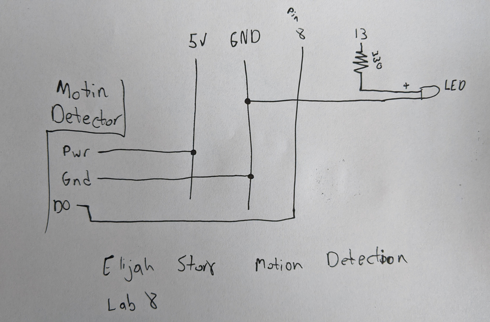

# Lab8-Elijah-Story

## #1
- I am going to use the motion detector to detect if there is anything moving that might “scare” the lantern. 
- Below is the diagram of the wiring. The motion detector gets 5V power from the arduino and is also connected to ground. The output from the detector goes to pin 8. The LED gets power from pin 13 that goes through a 330 resistor. The negative pin of the LED goes to ground.

- Here is the link to the video for the motion detector. [motion detector](https://photos.app.goo.gl/KPLEsoRSF497ePZUA)
- The sensor works and seems to be reliable if the motion is large enough and far away.
- All of the code was taken from the tutorial link in the lab. With that said, I don’t think it will be too hard to write my own code for the sensor. The sensor only outputs HIGH or LOW so it makes the code easy and more like a trigger.
- To use this input I will need to have the sensor outside of the lantern which is unfortunate.

## #2
- At first I wanted to use the sound sensor so that I could conceal it in the lantern without it being seen while still able to give input. As I describe in the code, the sensitivity is not very high or I could not figure out how to increase it. So the code does work, however it is not helpful for the lantern.
- Below is the diagram of the wiring. The sound sensor gets 5V power from the arduino and is also connected to ground. The signal from the sensor goes to analog pin A2. The LED gets power from pin ~10 that goes through a 330 resistor. The negative pin of the LED goes to ground.

- Here is the link to the video for the sound sensor. [Sound sensor](https://photos.app.goo.gl/k5L6Rtpti5GeLmVY8)
- I got it to work a little bit better, but it still can not “hear” a snap of the fingers.
- It would have been very covenant to just have the sound board next to the LED hidden inside the dome.
