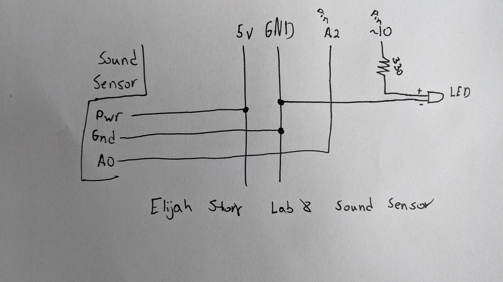

# Lab8-Elijah-Story

## #1

## #2
- At first I wanted to use the sound sensor so that I could conceal it in the lantern without it being seen while still able to give input. As I describe in the code, the sensitivity is not very high or I could not figure out how to increase it. So the code does work, however it is not helpful for the lantern.
- Below is the diagram of the wiring. The sound sensor gets 5V power from the arduino and is also connected to ground. The signal from the sensor goes to analog pin A2. The LED gets power from pin ~10 that goes through a 330 resistor. The negative pin of the LED goes to ground.

- Here is the link to the video for the sound sensor. [Sound sensor](https://photos.app.goo.gl/Ca41d4Js2V8ab6Lr6)
- Like stated above, I can not get the sensitivity to work properly.
- It would have been very covenant to just have the sound board next to the LED hidden inside the dome.
